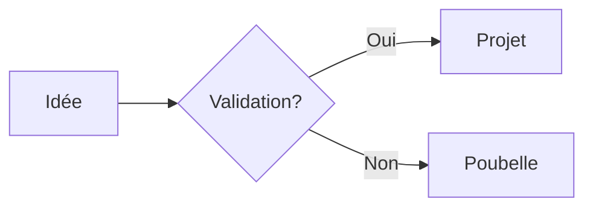

# 🧩 Bibliothèque de Composants (UI Kit)

Copiez-collez ces blocs pour enrichir vos notes.

## 📢 1. Callouts (Mise en avant)

Les Callouts sont natifs à Obsidian.

```markdown
> [!NOTE] Note standard
> Idéal pour des annotations simples.

> [!TIP] Astuce
> Pour les conseils ou hacks.

> [!SUCCESS] Succès / Validé
> Pour marquer une étape accomplie.

> [!WARNING] Attention
> Point de vigilance.

> [!ERROR] Critical
> Erreur ou blocage.

> [!TODO] A faire
> - [ ] Tâche intégrée
```

**Rendu :**
> [!NOTE] Note standard
> Idéal pour des annotations simples.

> [!TIP] Astuce
> Pour les conseils ou hacks.

> [!WARNING] Attention
> Point de vigilance.

---

## 📊 2. Dataview (Tableaux dynamiques)

*Nécessite le plugin Dataview.*

### Liste des Projets en cours
```dataview
TABLE without id file.link as "Projet", deadline as "Deadline"
FROM "1. Projects"
WHERE file.name != "1. Projects"
SORT deadline ASC
```

### Dernières notes modifiées (Top 5)
```dataview
LIST FROM ""
SORT file.mtime DESC
LIMIT 5
```

### Tâches non terminées (partout)
```dataview
TASK
WHERE !completed
```

### Livres à lire (Vue Galerie primitive)
```dataview
TABLE author as "Auteur", rating as "Note"
FROM #media/book
WHERE status = "reading"
```

---

## 📐 3. Layouts (Mise en page)

### Colonnes (via Callout)
*Astuce : Utilisez un callout aligné pour simuler une colonne latérale.*

```markdown
> [!info|right-small] Méta-données
> **Auteur** : Moi
> **Date** : Aujourd'hui
> **Statut** : #status/seed

Le texte principal de votre note commencera à gauche de cet encadré qui flottera à droite.
```

### Barre de progression (HTML)
```html
<progress value="40" max="100"></progress> 40%
```
<progress value="40" max="100"></progress> 40%

---

## 🖼️ 4. Mermaid (Schémas)

### Diagramme de flux simple


**Code :**
````markdown

````
